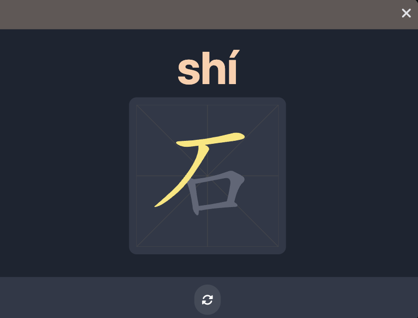

## 项目简介

本项目是使用 Ionic 框架和 Angular 开发的一个移动端 App，注意用于学龄前儿童学习汉字的 App。

## 技术栈

- Ionic & Capacitor：打包为移动端 App 的框架
- Angular：前端框架
- phaser: 游戏引擎
- Tailwind CSS：CSS 框架
- howler: 音频播放库
- hanzi-writer: 汉字书写库
- pinyin-pro: 汉字转拼音库

## 功能介绍

### 学龄前汉字学习

- 将学龄前常用汉字按主题分类，便于分类记忆。
- 每个汉字包括拼音，汉字书写，组词以及造句，和便于儿童理解的一张与汉字相关的图片。
- 书写练习，每个汉字提供书写笔画动画，以及书写笔画练习，强化宝宝对于汉字的书写记忆。
- 汉字泡泡游戏：每个分组的汉字学习完毕后，可以玩一玩汉字泡泡游戏，巩固加深分组学习的印象。

### 截图

